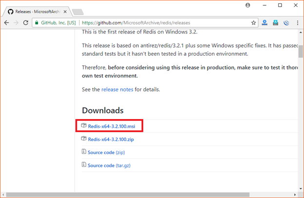
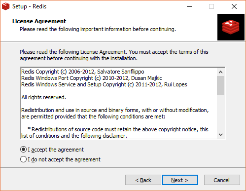
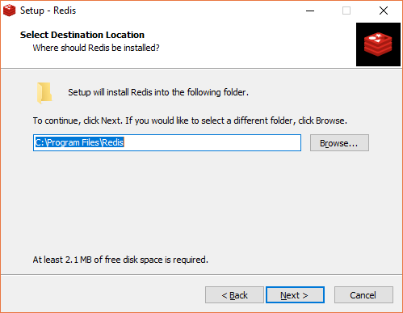
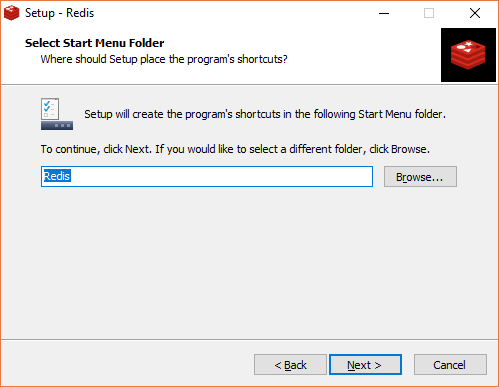
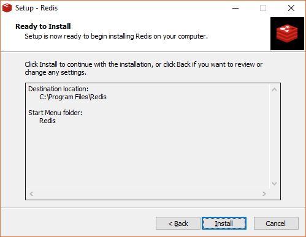
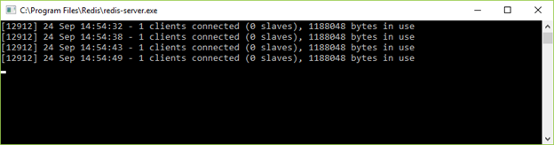

# Windows中安装Redis

Redis 官方不建议在 windows 下使用 Redis，所以官网没有 windows 版本可以下载。还好微软团队维护了开源的 windows 版本，虽然只有 3.2 版本，对于普通测试使用足够了。

## 安装包方式安装 Redis 服务

下载地址：[https://github.com/MicrosoftArchive/redis/releases](https://github.com/MicrosoftArchive/redis/releases)

点击下载：




您可以看到 Redis 现在已下载。

或者您也可以使用下面链接下载。

[https://github.com/rgl/redis/downloads](https://github.com/rgl/redis/downloads)

下载完成之后双击按着引导流程安装。

 






* * *

## 启动 Redis

Redis 现在可以使用了。打开 Redis 程序目录：


文件介绍：

redis-server.exe：服务端程序，提供 redis 服务

redis-cli.exe: 客户端程序，通过它连接 redis 服务并进行操作

redis-check-dump.exe：RDB 文件修复工具

redis-check-aof.exe：AOF 文件修复工具

redis-benchmark.exe：性能测试工具，用以模拟同时由 N 个客户端发送 M 个 SETs/GETs 查询 (类似于 Apache 的 ab 工具)

redis.windows.conf： 配置文件，将 redis 作为普通软件使用的配置，命令行关闭则 redis 关闭

redis.windows-service.conf：配置文件，将 redis 作为系统服务的配置

单击 redis-server.exe，启动 Redis 服务。


现在启动 Redis 客户端。

 

检查 Redis 是否已连接。

使用 PING 命令。


Redis 服务窗口也输出 1 个客户端已连接。



## 直接解压的方式安装 redis

首先下载 redis 安装包：[https://github.com/MSOpenTech/redis/releases](https://github.com/MSOpenTech/redis/releases)


解压安装包到相应文件夹，任何盘符都行，例如 E:\\tools\\redis-3.2.100。

### 使用命令行启动 Redis 服务

运行 cmd，cd 进入对应目录 E:\\tools\\redis-3.2.100，执行：

```
redis-server.exe redis.windows.conf 
```

\*注：可以把 redis 的路径加到系统的环境变量里，这样就省得再输路径了，后面的那个 redis.windows.conf 可以省略，如果省略，会启用默认的参数。

输入之后会显示如下：


### 安装 redis 到 windows 服务

```
redis-server --service-install redis.windows.conf
```

查看 windows 服务是否加入：


这时候先关闭打开的第一个 cmd 窗口，然后执行以下命令启动再次 redis：

```
redis-server --service-start
```

停止 redis 服务：

```
redis-server --service-stop
```

最后，测试一下 redis 是否能够正常使用：

切换到 redis 目录下：E:\\tools\\redis-3.2.100  下：

```
redis-cli.exe -h 127.0.0.1 -p 6379 
```
