# Windows中安装JDK

**原文作者：souvc** **博文出处：**[**http://www.cnblogs.com/liuhongfeng/p/4177568.html**](https://cloud.tencent.com/developer/tools/blog-entry?target=http%3A%2F%2Fwww.cnblogs.com%2Fliuhongfeng%2Fp%2F4177568.html&objectId=1698454&objectType=1&isNewArticle=undefined)

**本节内容：**

**以下是详细步骤**

**一、准备工具:**

1.JDK

JDK 可以到[官网下载](http://www.oracle.com/technetwork/java/javase/downloads/jdk8-downloads-2133151.html)

2.系统

我这里是WINDOWS7 64系统

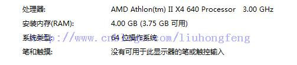

可以根据系统的版本下载相对应的JDK。

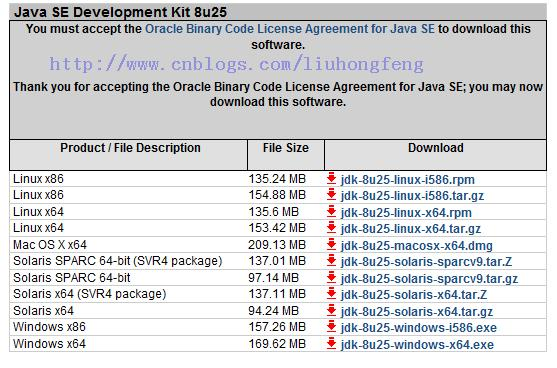

我这里选择：jdk-8u25-windows-x64.exe

注意区分：

Java SE Development Kit 8u25 Java SE Development Kit 8u25 Demos and Samples Downloads JavaFX Demos and Samples Downloads

第一个 java se开发包 第二个 java se开发包+示例 第三个 javaFX开发包和示例

第一个是必须的配置Java开发环境的

**二、方法/步骤**

1.安装JDK，JRE， 选择安装目录

安装过程中会出现两次 安装提示 。第一次是安装 jdk ，第二次是安装 jre 。建议两个都安装在同一个java文件夹中的不同文件夹中。（不能都安装在java文件夹的根目录下，jdk和jre安装在同一文件夹会出错）。

（1）双击jdk-8u25-windows-x64.exe 进行安装。

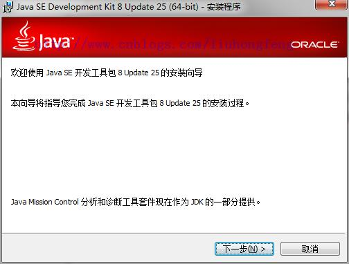

（2）点击“下一步”继续。

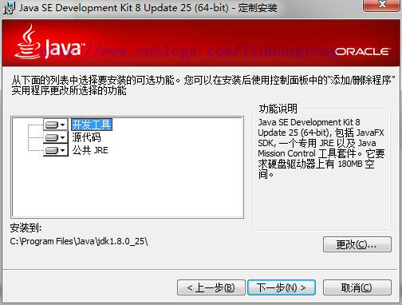

（3）选择安装路径，然后点击下一步。

默认是在C盘。我这里选择的是D盘。路径为：D:\\Java\\jdk1.8.0\_25\\

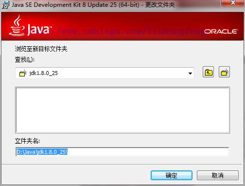

（4）等待安装结束之后。选择JRE安装的路径，点击下一步。

默认会选择C盘。

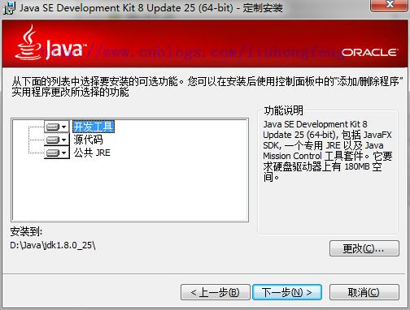

等待安装完成。

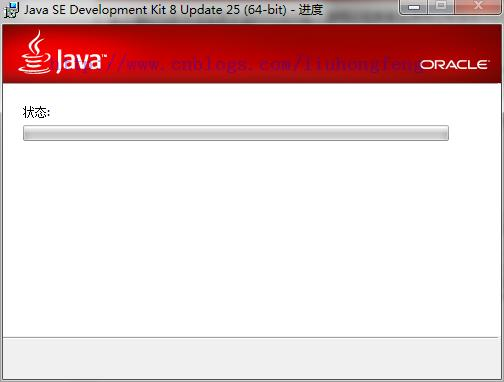

（5）JRE的安装

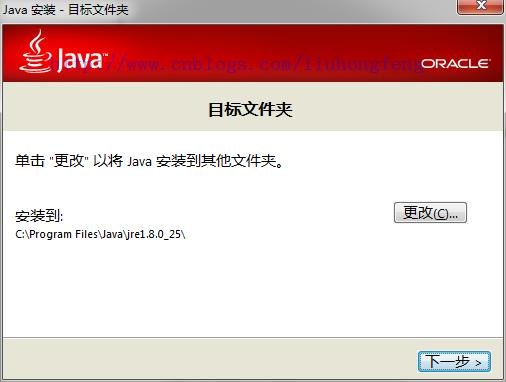

（6）我这里选择D盘。选择更改的时候，先在硬盘里面建一个文件夹。因为在选择的时候它不给新建。我这里是建了一个：jre1.8.0\_25 文件夹。

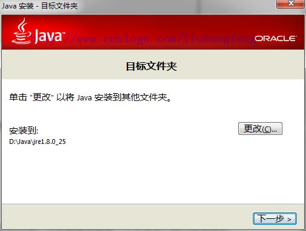

（7）安装完成，点击关闭。

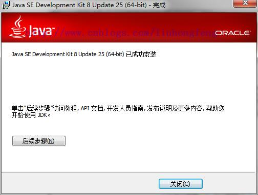

**2.配置系统环境**

配置环境变量：右击“我的电脑”-->"高级"-->"环境变量"。

（1）JAVA\_HOME环境变量。 作用：它指向jdk的安装目录，Eclipse/NetBeans/Tomcat等软件就是通过搜索JAVA\_HOME变量来找到并使用安装好的jdk。 配置方法：在系统变量里点击新建，变量名填写JAVA\_HOME，变量值填写JDK的安装路径。（根据自己的安装路径填写）

JAVA\_HOME：D:\\Java\\jdk1.8.0\_25

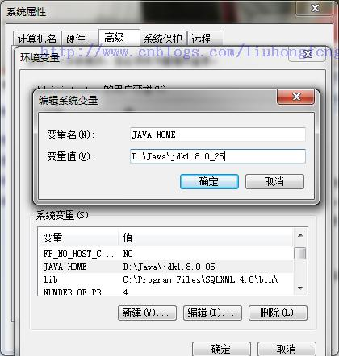

（2）CLASSPATH环境变量。

作用：是指定类搜索路径，要使用已经编写好的类，前提当然是能够找到它们了，JVM就是通过CLASSPTH来寻找类的。我们需要把jdk安装目录下的lib子目录中的dt.jar和tools.jar设置到CLASSPATH中，当然，当前目录“.”也必须加入到该变量中。 配置方法： 新建CLASSPATH变量，变量值为：.;%JAVA\_HOME%\\lib;%JAVA\_HOME%\\lib\\tools.jar 。CLASSPATH变量名字，可以大写也可以小写。注意不要忘记前面的点和中间的分号。且要在英文输入的状态下的分号和逗号。

CLASSPATH ：.;%JAVA\_HOME%\\lib;%JAVA\_HOME%\\lib\\dt.jar;%JAVA\_HOME%\\lib\\tools.jar;

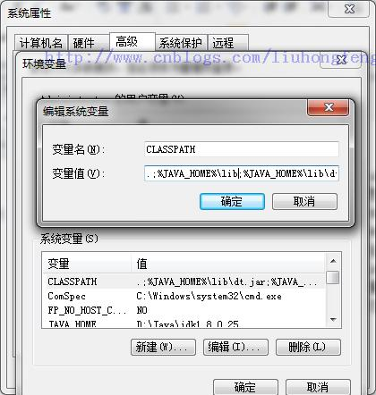

（3）path环境变量

作用：指定命令搜索路径，在i命令行下面执行命令如javac编译java程序时，它会到PATH变量所指定的路径中查找看是否能找到相应的命令程序。我们需要把jdk安装目录下的bin目录增加到现有的PATH变量中，bin目录中包含经常要用到的可执行文件如javac/java/javadoc等待，设置好PATH变量后，就可以在任何目录下执行javac/java等工具了。

在系统变量里找到Path变量，这是系统自带的，不用新建。双击Path，由于原来的变量值已经存在，故应在已有的变量后加上“;%JAVA\_HOME%\\bin;%JAVA\_HOME%\\jre\\bin”。注意前面的分号。

Path：;%JAVA\_HOME%\\bin;%JAVA\_HOME%\\jre\\bin

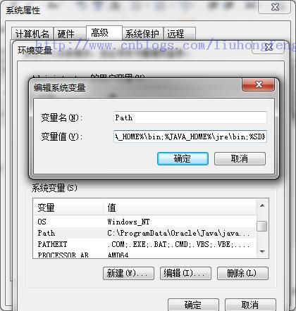

然后点击确定完成。

**三、 测试环境。**

检验是否配置成功 运行cmd 分别输入java，javac， java -version （java 和 -version 之间有空格）。

1.Java

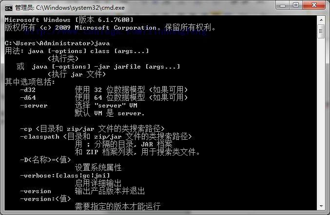

2.Javac

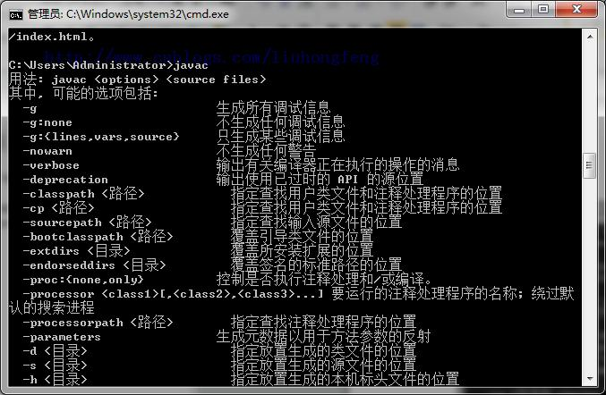

3.java –version

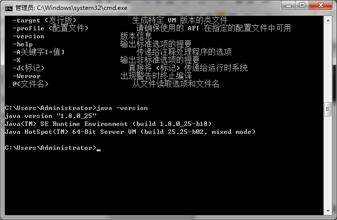

若如图所示 显示版本信息 则说明安装和配置成功。

也可以在命令行输入 echo %JAVA\_HOME% 来查看当前的javahome路径。

小结： 环境变量： JAVA\_HOME：D:\\Java\\jdk1.8.0\_25 CLASSPATH ：.;%JAVA\_HOME%\\lib;%JAVA\_HOME%\\lib\\dt.jar;%JAVA\_HOME%\\lib\\tools.jar; Path：;%JAVA\_HOME%\\bin;%JAVA\_HOME%\\jre\\bin

测试： Java，javac，java –version

注意：

原文作者：souvc 博文出处：[http://www.cnblogs.com/liuhongfeng/p/4177568.html](https://cloud.tencent.com/developer/tools/blog-entry?target=http%3A%2F%2Fwww.cnblogs.com%2Fliuhongfeng%2Fp%2F4177568.html&objectId=1698454&objectType=1&isNewArticle=undefined)

本文参与 [腾讯云自媒体同步曝光计划](https://cloud.tencent.com/developer/support-plan)，分享自作者个人站点/博客。

原始发表：2014-12-22 ，

如有侵权请联系 [cloudcommunity@tencent.com](mailto:cloudcommunity@tencent.com) 删除
