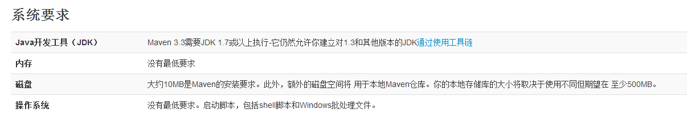
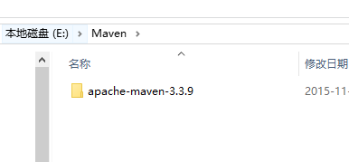
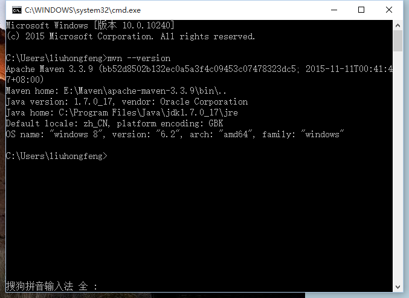
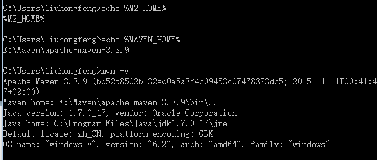

# Windows中安装Maven

 Maven是一个项目管理的Java 工具，在JavaEE中，我们可以使用Maven方便地管理团队合作的项目，现在我们在学习JavaEE框架，使用Maven可以管理类库，有效方便地供团队中的其他人员使用。

**一、下载 Maven 。**

请访问Maven的下载页面 [官网下载](http://maven.apache.org/download.html)，其中包含针对不同平台的各种版本的Maven下载文件。

注意：

 

我这里下载的是：apache-maven-3.3.9-bin.zip 版本。

**二、解压 maven 压缩包。**

解压apache-maven-3.1.1-bin.zip，并把解压后的文件夹下的apache-maven-3.1.1文件夹移动到E:\Maven 下，如果没有Maven 这个文件夹的话，请自行创建。

**三、配置maven 的环境变量**

右键“计算机”，选择“属性”，之后点击“高级系统设置”，点击“环境变量”，来设置环境变量，有以下系统变量需要配置：

新建系统变量  MAVEN_HOME  变量值：E:\Maven\apache-maven-3.3.9

编辑系统变量  Path     添加变量值： ;%MAVEN_HOME%\bin

注意：注意多个值之间需要有分号隔开，然后点击**确定**。

**四、检测是否安装成功。**

最后检验配置是否成功：用win键+R，来打开命令行提示符窗口，即Dos界面，输入mvn --version  若出现以下情况说明配置成功
 

或是输入：**echo %M2_HOME%**

查看版本：mvn -v

**五、升级。**

Maven还比较年轻，更新比较频繁，因此用户往往会需要更新Maven安装以获得更多更酷的新特性，以及避免一些旧的bu

只需要按照上面的配置过程换成新的包即可。

 