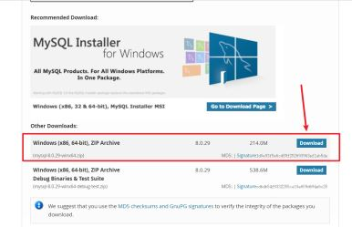
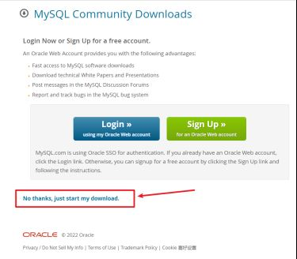
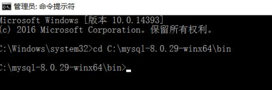
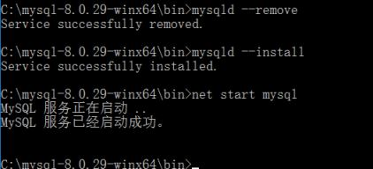
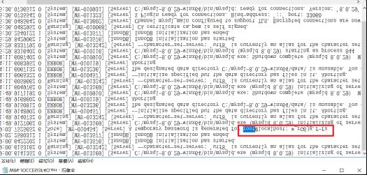
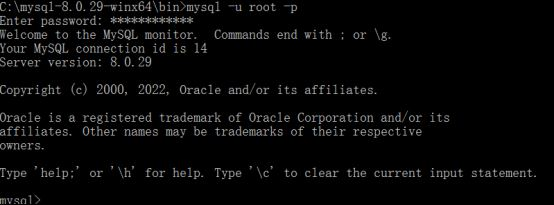
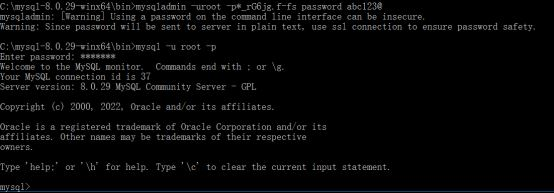

# WindowsServer2012r2中安装MySQL

MySQL
1.首先去MySQL的官网下载安装包

2.其他下载需要登录，选择下面的直接安装

3.然后解压到文件夹中（本文解压C:\mysql-8.0.29-winx64），并配置初始化的mi.ini文件（创建my.ini文件并把以下内容粘贴进去，记得先在解压路径下创建data文件夹哦），文件创建好后放到解压路径：C:\mysql-8.0.29-winx64 下
文件内容：
[mysql]
设置mysql客户端默认字符集
default-character-set=utf8
[mysqld]
设置3306端口
port = 3306
设置mysql的安装目录
basedir=C:\mysql-8.0.29-winx64
设置mysql数据库的数据的存放目录
datadir=C:\mysql-8.0.29-winx64\data
允许最大连接数
max_connections=200
服务端使用的字符集默认为8比特编码的latin1字符集
character-set-server=utf8
创建新表时将使用的默认存储引擎
default-storage-engine=INNODB
4.安装MySQL，管理员权限使用cmd命令进入命令窗口，且cd到安装路径的bin目录下，
mysql—install（安装）成功的话如下图所示：

mysqld --initialize （初始化）
net start mysql（运行）

5.修改密码
在data目录里面，找到“.err”结尾的文件，以记事本方式打开，找到“root@localhost”，后面就是密码

成功登录进去，
修改MySQL的root用户密码格式：mysqladmin -u用户名 -p旧密码； password 新密码

到此这篇关于在windows server 2012 r2中安装mysql的文章就介绍到这了,更多相关windows server 2012 r2安装mysql内容请搜索脚本之家以前的文章或继续浏览下面的相关文章希望大家以后多多支持脚本之家！