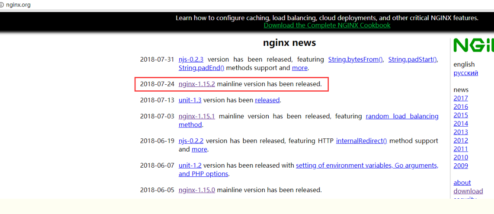
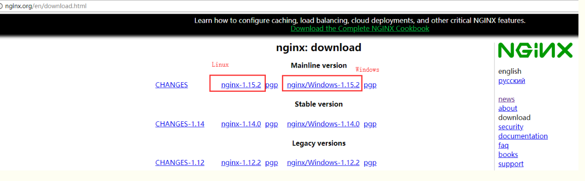
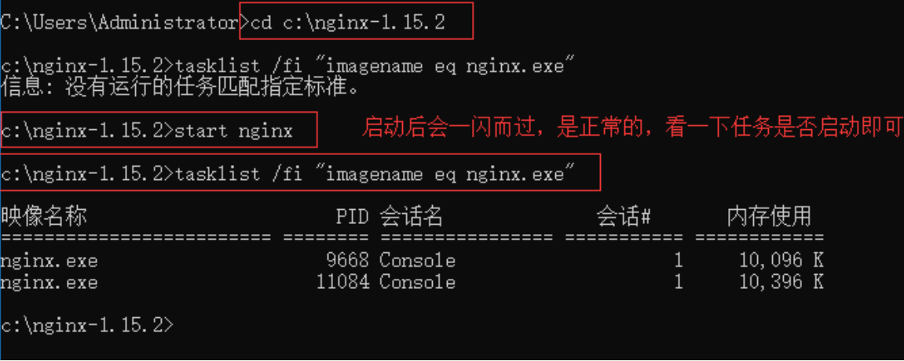
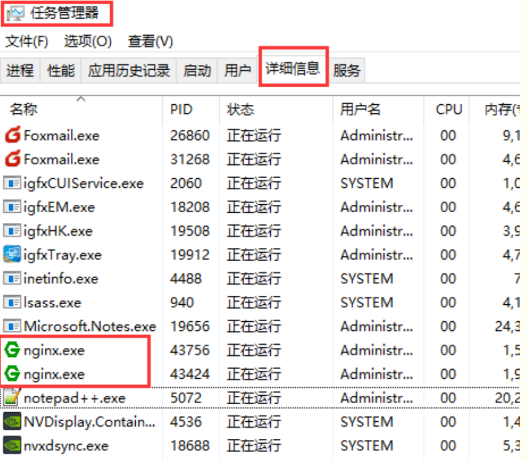
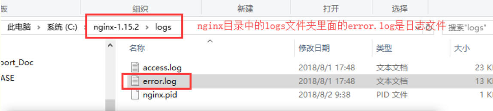
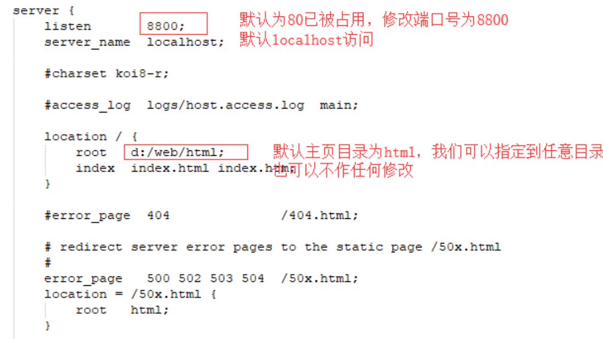
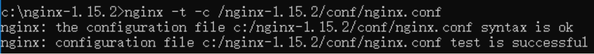
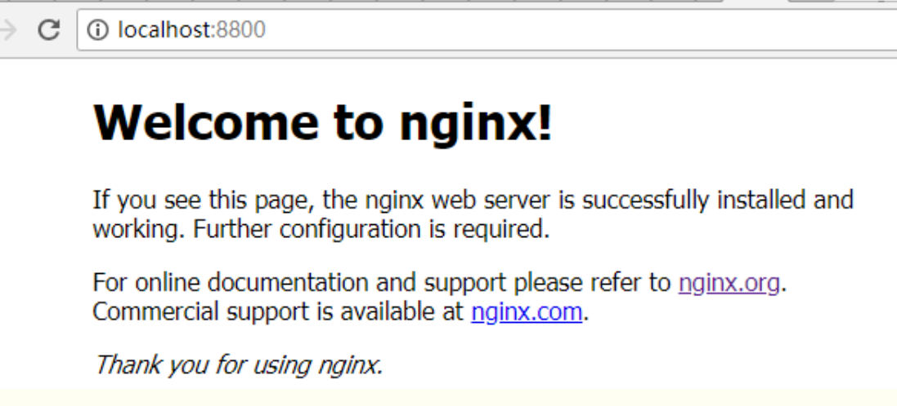

## 一、Nginx简介

Nginx (engine x) 是一个高性能的HTTP和反向代理服务器，也是一个IMAP/POP3/SMTP服务器。Nginx是由伊戈尔·赛索耶夫为俄罗斯访问量第二的Rambler.ru 站点（俄文：Рамблер）开发的.

它也是一种轻量级的Web服务器，可以作为独立的服务器部署网站（类似Tomcat）。它高性能和低消耗内存的结构受到很多大公司青睐，如淘宝网站架设。

先下载直接去官网 [nginx.org](https://www.cnblogs.com/taiyonghai/p/nginx.org)



分别有Linux和Windows两个版本



点击后就会下载，下载完成后开始安装，其实官网已经告诉了如何安装，右侧“documentation -> nginx windows”就有详细的说明，只是英文而已

 
## 二、安装部署

#### 1、下载完成后，解压缩，运行cmd，使用命令进行操作，不要直接双击nginx.exe，不要直接双击nginx.exe，不要直接双击nginx.exe

一定要在dos窗口启动，不要直接双击nginx.exe，这样会导致修改配置后重启、停止nginx无效，需要手动关闭任务管理器内的所有nginx进程，再启动才可以

#### 2、使用命令到达nginx的加压缩后的目录

```powershell
cd c:\nginx-1.15.2
```

#### 3、启动nginx服务，启动时会一闪而过是正常的
```powershell
start nginx
```
#### 4、查看任务进程是否存在，dos或打开任务管理器都行
```powershell
tasklist /fi "imagename eq nginx.exe"
```


打开任务管理器在进程中看不到nginx.exe的进程（双击nginx.exe时会显示在这里），需要打开详细信息里面能看到隐藏的nginx.exe进程



如果都没有可能是启动报错了查看一下日志，在nginx目录中的logs文件夹下error.log是日志文件



常见的错误：

(1)端口号被占用

(2)nginx文件夹路径含中文

其他错误就详细看log中的描述

#### 5、修改配置文件，进入解压缩目录，直接文件夹点击进去即可，不需要从dos操作


在conf目录下找到nginx.conf使用txt文本打开即可，找到server这个节点，修改端口号，如果有需求可以修改主页目录没有就不用修改



修改完成后保存，使用以下命令检查一下配置文件是否正确，后面是nginx.conf文件的路径，successful就说明正确了
```powershell
nginx -t -c /nginx-1.15.2/conf/nginx.conf
```


如果程序没启动就直接start nginx启动，如果已经启动了就使用以下命令重新加载配置文件并重启
```powershell
nginx -s reload
```
之后就打开浏览器访问刚才的域名及端口http://localhost:8800，出现欢迎页就说明部署成功了



#### 6、关闭nginx服务使用以下命令，同样也是一闪而过是正常的，看一下是否进程已消失即可

快速停止
```powershell
nginx -s stop
```
完整有序的关闭
```powershell
nginx -s quit
```


## 三、优化配置

 打开nginx.conf按照自己需求进行配置，下面列出简单的一些常规调优配置

```nginx
#user  nobody;
#==工作进程数，一般设置为cpu核心数
worker_processes  1;
#error_log  logs/error.log;
#error_log  logs/error.log  notice;
#error_log  logs/error.log  info;
#pid     logs/nginx.pid;
events {
   #==最大连接数，一般设置为cpu*2048
   worker_connections  1024;
}
http {
   include    mime.types;
   default_type  application/octet-stream;
   #log_format  main  '$remote_addr - $remote_user [$time_local] "$request" '
   #          '$status $body_bytes_sent "$http_referer" '
   #          '"$http_user_agent" "$http_x_forwarded_for"';
   #access_log  logs/access.log  main;
   sendfile     on;
   #tcp_nopush   on;
   #keepalive_timeout  0;
   #==客户端链接超时时间
   keepalive_timeout  65;
   #gzip  on;
   #当配置多个server节点时，默认server names的缓存区大小就不够了，需要手动设置大一点
   server_names_hash_bucket_size 512;
   #server表示虚拟主机可以理解为一个站点，可以配置多个server节点搭建多个站点
   #每一个请求进来确定使用哪个server由server_name确定
   server {
     #站点监听端口
     listen    8800;
     #站点访问域名
     server_name  localhost;
     #编码格式，避免url参数乱码
     charset utf-8;
     #access_log  logs/host.access.log  main;
     #location用来匹配同一域名下多个URI的访问规则
     #比如动态资源如何跳转，静态资源如何跳转等
     #location后面跟着的/代表匹配规则
     location / {
       #站点根目录，可以是相对路径，也可以使绝对路径
       root  html;
       #默认主页
       index  index.html index.htm;
       #转发后端站点地址，一般用于做软负载，轮询后端服务器
       #proxy_pass http://10.11.12.237:8080;
       #拒绝请求，返回403，一般用于某些目录禁止访问
       #deny all;
       #允许请求
       #allow all;
       add_header 'Access-Control-Allow-Origin' '*';
       add_header 'Access-Control-Allow-Credentials' 'true';
       add_header 'Access-Control-Allow-Methods' 'GET, POST, OPTIONS';
       add_header 'Access-Control-Allow-Headers' 'DNT,X-CustomHeader,Keep-Alive,User-Agent,X-Requested-With,If-Modified-Since,Cache-Control,Content-Type';
       #重新定义或者添加发往后端服务器的请求头
       #给请求头中添加客户请求主机名
       proxy_set_header Host $host;
       #给请求头中添加客户端IP
       proxy_set_header X-Real-IP $remote_addr;
       #将$remote_addr变量值添加在客户端“X-Forwarded-For”请求头的后面，并以逗号分隔。 如果客户端请求未携带“X-Forwarded-For”请求头，$proxy_add_x_forwarded_for变量值将与$remote_addr变量相同  
       proxy_set_header X-Forwarded-For $proxy_add_x_forwarded_for;
       #给请求头中添加客户端的Cookie
       proxy_set_header Cookie $http_cookie;
       #将使用代理服务器的主域名和端口号来替换。如果端口是80，可以不加。
       proxy_redirect off;
       #浏览器对 Cookie 有很多限制，如果 Cookie 的 Domain 部分与当前页面的 Domain 不匹配就无法写入。
       #所以如果请求 A 域名，服务器 proxy_pass 到 B 域名，然后 B 服务器输出 Domian=B 的 Cookie，
       #前端的页面依然停留在 A 域名上，于是浏览器就无法将 Cookie 写入。
       #不仅是域名，浏览器对 Path 也有限制。我们经常会 proxy_pass 到目标服务器的某个 Path 下，
       #不把这个 Path 暴露给浏览器。这时候如果目标服务器的 Cookie 写死了 Path 也会出现 Cookie 无法写入的问题。
       #设置“Set-Cookie”响应头中的domain属性的替换文本，其值可以为一个字符串、正则表达式的模式或一个引用的变量
       #转发后端服务器如果需要Cookie则需要将cookie domain也进行转换，否则前端域名与后端域名不一致cookie就会无法存取
      #配置规则：proxy_cookie_domain serverDomain(后端服务器域) nginxDomain(nginx服务器域)
       proxy_cookie_domain localhost .testcaigou800.com;
       #取消当前配置级别的所有proxy_cookie_domain指令
       #proxy_cookie_domain off;
       #与后端服务器建立连接的超时时间。一般不可能大于75秒；
       proxy_connect_timeout 30;
     }
     #error_page  404        /404.html;
     # redirect server error pages to the static page /50x.html
     error_page  500 502 503 504  /50x.html;
     location = /50x.html {
       root  html;
     }
  }
  #当需要对同一端口监听多个域名时，使用如下配置，端口相同域名不同，server_name也可以使用正则进行配置
  #但要注意server过多需要手动扩大server_names_hash_bucket_size缓存区大小
  server {
  　listen 80;
  　server_name www.abc.com;
  　charset utf-8;
  　location / {
  　proxy_pass http://localhost:10001;
  　}
　}
　server {
  　listen 80;
  　server_name aaa.abc.com;
  　charset utf-8;
  　location / {
  　proxy_pass http://localhost:20002;
  　}
　}
}
```